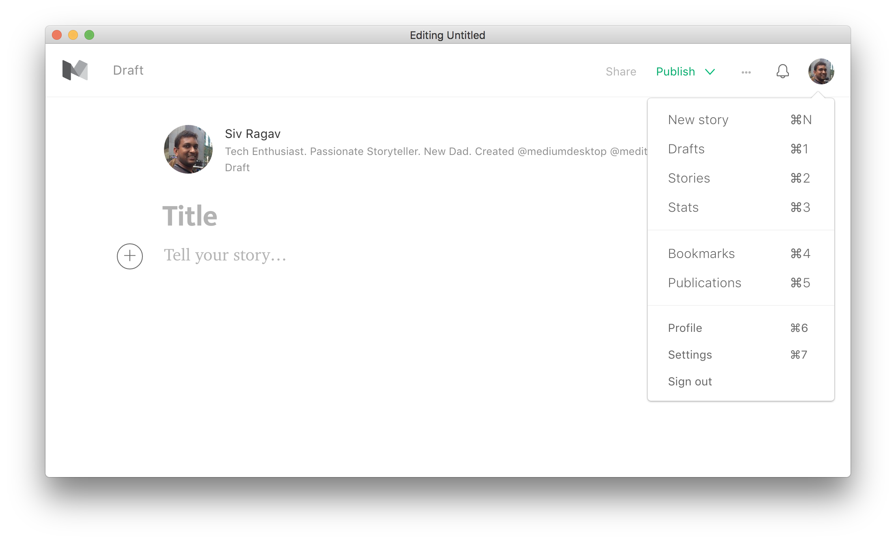

# Desktop App for Medium - MediumDesk

> Developed by Medium enthusiasts

<br>
[](https://github.com/sivragav/mediumdesk/releases/latest)


## Background behavior

When closing the window, the app will continue running in the background, in the dock on OS X and the tray on Linux/Windows. Right-click the dock/tray icon and choose `Quit` to completely quit the app. On OS X, click the dock icon to show the window. On Linux, right-click the tray icon and choose `Toggle` to toggle the window. On Windows, click the tray icon to toggle the window.

## Install

*OS X 10.9+, Windows 7+ & Linux are supported.*

### OS X

[**Download**](https://github.com/sivragav/mediumdesk/releases/latest), unzip, and move `MediumDesk.app` to the `/Applications` directory.

### Linux

[**Download**](https://github.com/sivragav/mediumdesk/releases/latest) and unzip to some location.

To add a shortcut to the app, create a file in `~/.local/share/applications` called `mediumdesk.desktop` with the following contents:

```
[Desktop Entry]
Name=MediumDesk
Exec=/full/path/to/folder/MediumDesk
Terminal=false
Type=Application
Icon=/full/path/to/folder/MediumDesk/resources/app/static/Icon.png
```

### Windows

[**Download**](https://github.com/sivragav/mediumdesk/releases/latest) and unzip to some location.


---


## Dev

Built with [Electron](http://electron.atom.io).

###### Commands

- Init: `$ npm install`
- Run: `$ npm start`
- Build OS X: `$ npm run build:osx`
- Build Linux: `$ npm run build:linux`
- Build Windows: `$ npm run build:windows`
- Build all: `$ brew install wine` and `$ npm run build` *(OS X only)*


## License

MIT © [Sivaprakash Ragavan](https://medium.com/desktop-apps)
