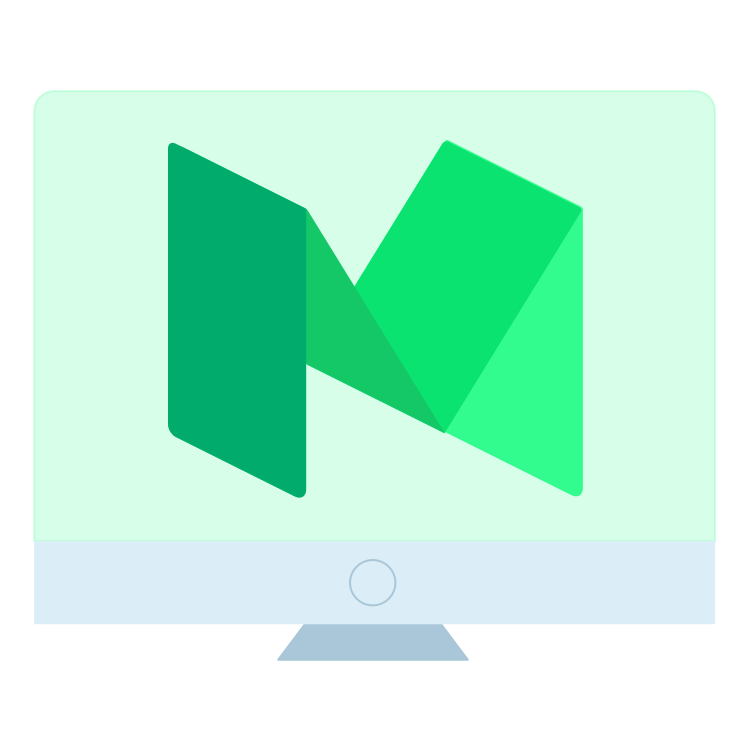

# MediumDesk
MediumDesk is a simple app that lets you read and write Medium stories when you are at your desk. *Developed by Medium enthusiasts*

[Download the app today, and enjoy the best of Medium on your desktop.](https://github.com/sivragav/mediumdesk/releases/latest)

## Features
The goal of this app is to purely extend medium.com's experience into desktops. We don't intend to modify/replace any behavior. For every feature we add, we ask ourselves "Would Medium do it, If they built a desktop app?".

* The first goal is to be able to use medium.com without any issues in it's own window. So it is always accessible through your Applications folder, Dock / Task Bar, Search. To find your draft,  you don't have to dig through browser tabs anymore.
* Native Menus & Shortcuts for commonly used functions (<kbd>Cmd</kbd> <kbd>N</kbd> / <kbd>Ctrl</kbd> <kbd>N</kbd> - New Story, <kbd>Cmd</kbd> <kbd>F</kbd> / <kbd>Ctrl</kbd> <kbd>F</kbd> - Search Medium, <kbd>Cmd</kbd> <kbd>0-7</kbd> / <kbd>Ctrl</kbd> <kbd>0-7</kbd> - Home, Drafts, Public Stories, Stats, Bookmarks, Publications, Profile, Settings.)

## Coming Soon
* Back & Forward within the App
* Open in Browser
* Pin pages to keep them open
* External URLs show a top bar similar to medium

[This Trello Board](https://trello.com/b/xRgXfJ2y/mediumdesk) shows the complete list of features we are working on.

---

## Dev

## Issues

Feel free to submit issues and enhancement requests.

## Contributing

MediumDesk is built with [Electron](http://electron.atom.io) & would love to accept pull requests for any issues or feature request.

[Read more on contributing](https://github.com/sivragav/mediumdesk/blob/master/CONTRIBUTING.md)

###### Commands

- Init: `$ npm install`
- Run: `$ npm start`
- Build OS X: `$ npm run build:osx`
- Build Linux: `$ npm run build:linux`
- Build Windows: `$ npm run build:windows`
- Build all: `$ brew install wine` and `$ npm run build` *(OS X only)*

## License

MIT © [Sivaprakash Ragavan](https://medium.com/desktop-apps)
